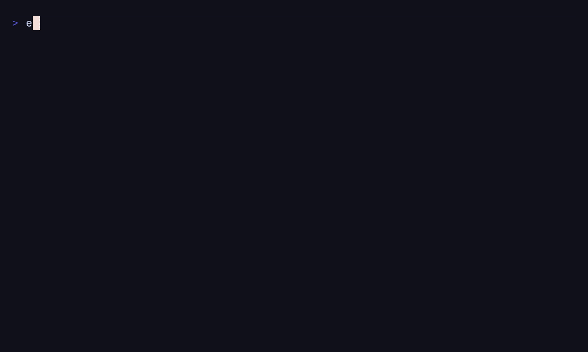

# TokenSave

[](https://github.com/vexato/tokensave/actions/workflows/ci.yml)
[](https://github.com/vexato/tokensave/releases)
[](LICENSE)
[](go.mod)

> **Compact command output for coding agents — without losing the full log.**

TokenSave is a local-first Go CLI that turns verbose terminal output into compact, actionable summaries for developers, scripts, CI workflows, and coding agents.

It runs the original command, stores complete `stdout` and `stderr` locally, redacts common secrets from the displayed summary, and returns the command's original exit code.

<p align="center">
  
</p>

```sh
tokensave npm test
```

```text
Status: failed
Parser: npm
Duration: 18.4s

2 failures detected

1. UserTest::testCreate
   Expected status 201, received 500

2. UserTest::testDelete
   Expected record to be deleted

Run ID: 20260727-153045-a81f
Inspect: tokensave show 20260727-153045-a81f --failure 1
```

**Local by default. Reversible by design. Built for noisy commands.**

* Complete logs stay on your machine
* No telemetry, account, or remote API
* Secrets are redacted from displayed summaries
* Original exit codes are preserved
* Previous runs can be inspected progressively
* Stable JSON output is available for automation

[Installation](#installation) · [Quick start](#quick-start) · [How it works](#how-it-works) · [Supported parsers](#supported-parsers) · [Benchmarks](#benchmarks) · [Contributing](#contributing)

## Why TokenSave?

Test suites, package managers, build tools, and Git commands can produce hundreds or thousands of lines of output.

For developers, that makes the useful failure harder to find.

For coding agents, it fills the context window with repeated logs instead of the information needed to solve the problem.

TokenSave provides a progressive inspection workflow:

```text
Compact summary
      ↓
Single failure
      ↓
Relevant line range
      ↓
Complete log, only when necessary
```

You start with the signal and keep access to the evidence.

## Installation

Pre-built binaries are available for Linux, macOS, and Windows. Go is not required.

### Linux and macOS

```sh
curl -fsSL https://raw.githubusercontent.com/vexato/tokensave/main/scripts/install.sh | sh
```

### Windows PowerShell

```powershell
irm https://raw.githubusercontent.com/vexato/tokensave/main/scripts/install.ps1 | iex
```

The installers:

* download the correct pre-built GitHub Release asset;
* verify its SHA-256 checksum against the release `checksums.txt`;
* install the TokenSave binary;
* install the bundled global Codex Skill by default.

### Install only the binary

Linux and macOS:

```sh
TOKENSAVE_INSTALL_SKILL=0 sh install.sh
```

PowerShell:

```powershell
.\install.ps1 -SkipSkill
```

`-SkipCodexSkill` remains available as a PowerShell compatibility alias.

### Codex Skill locations

```text
Linux and macOS: $HOME/.agents/skills/tokensave
Windows:          %USERPROFILE%\.agents\skills\tokensave
```

Set `TOKENSAVE_SKILL_DIR` to choose another global Skill directory.

The installers detect legacy installations under:

```text
~/.codex/skills/tokensave
```

They never delete them automatically. After confirming that the new Skill works, remove or migrate the legacy directory manually to avoid duplicate entries.

The PowerShell installer also adds the TokenSave binary directory to the user `PATH`.

### Build from source

Go 1.22 or later is required:

```sh
make build
make install
```

## Quick start

Wrap any command with `tokensave`:

```sh
tokensave git status
tokensave git diff
tokensave npm test
tokensave pnpm test
tokensave composer install
tokensave vendor/bin/phpunit
```

The optional `run` subcommand is also supported:

```sh
tokensave run vendor/bin/phpunit
```

Return a stable JSON summary:

```sh
tokensave npm test --json
```

Run a shell expression:

```sh
tokensave --shell "php artisan test && npm test"
```

Commands run directly without a shell by default. Regular arguments, including arguments containing spaces, remain safe.

Use `--shell` only when shell features such as command chaining, pipes, redirects, or variable expansion are intentionally required.

Use `--` before wrapped arguments that share a name with a TokenSave option:

```sh
tokensave tool -- --json
```

## Inspect only what matters

Every wrapped command receives a run ID.

List previous runs:

```sh
tokensave list
tokensave list --failed
```

Inspect one detected failure:

```sh
tokensave show 20260727-153045-a81f --failure 1
```

Inspect the end of a log:

```sh
tokensave show 20260727-153045-a81f --tail 50
```

Inspect a relevant line range:

```sh
tokensave show 20260727-153045-a81f --lines 40:80
```

Print the complete stored log:

```sh
tokensave show 20260727-153045-a81f --full
```

Delete old runs:

```sh
tokensave clean --older-than 7d
```

> `show --full` prints the complete stored log. Complete logs are intentionally retained without redaction and may contain sensitive data.

## How it works

For each wrapped command, TokenSave:

1. Executes the original command.
2. Captures `stdout` and `stderr`.
3. Stores both streams and a combined log.
4. Detects an appropriate parser when possible.
5. Extracts failures, paths, counts, and useful diagnostics.
6. Redacts sensitive values from the displayed summary.
7. Writes text, JSON, and metadata files.
8. Returns the child process's original exit code.

TokenSave does not hide failures. It can therefore be used in local scripts, CI workflows, and coding-agent automation.

## Designed for coding agents

TokenSave helps coding agents avoid loading an entire terminal transcript before understanding what failed.

A typical workflow is:

```text
1. Run the command through TokenSave
2. Read the compact summary
3. Inspect one failure
4. Request a relevant line range
5. Read the complete log only as a last resort
```

This makes TokenSave useful for workflows involving tests, dependency installation, builds, Git operations, and other commands with noisy output.

## Output limits

Terminal summaries use the following defaults:

| Setting            | Default |
| ------------------ | ------: |
| Maximum lines      |      80 |
| Maximum characters |  12,000 |
| Maximum failures   |       5 |

Override the limits for one invocation:

```sh
tokensave npm test \
  --max-lines 120 \
  --max-chars 20000 \
  --max-failures 10
```

Additional output modes:

```sh
# Print only the run ID
tokensave npm test --quiet

# Store the run without printing a summary
tokensave npm test --no-summary

# Print one stable JSON object
tokensave npm test --json
```

## JSON output

`--json` writes one stable JSON summary object:

```json
{
  "run_id": "20260727-153045-a81f",
  "status": "failed",
  "exit_code": 1,
  "duration_ms": 18400,
  "parser": "phpunit",
  "summary": {
    "tests": 4,
    "failed": 2
  },
  "failures": [
    {
      "index": 1,
      "name": "UserTest::testCreate",
      "message": "Expected 201"
    }
  ],
  "log_path": "/local/path"
}
```

TokenSave still returns the wrapped command's original exit code when JSON output is enabled.

## Supported parsers

TokenSave currently includes parsers for:

* Generic command output
* Git status
* Git diff
* PHPUnit
* Pest
* Composer
* npm
* pnpm
* yarn

When no dedicated parser matches, TokenSave falls back to the generic parser.

The parser registry uses a small `Detect`/`Parse` interface. New tools can be supported through focused fixtures and tests without changing the command runner.

Potential future parsers include:

* PHPStan
* ESLint
* TypeScript
* Jest
* Vitest
* Playwright

Parser contributions and real-world sanitized fixtures are welcome.

## Configuration

TokenSave reads optional configuration from:

1. `~/.config/tokensave/config.yml`
2. `.tokensave.yml` in the current project
3. command-line options

Command-line options have the highest priority.

Example:

```yaml
max_lines: 80
max_chars: 12000
max_failures: 5
retention_days: 14

redact:
  enabled: true
  patterns:
    - "MY_CUSTOM_SECRET=.*"

commands:
  "php test":
    parser: phpunit
```

## Storage

Set `TOKENSAVE_HOME` to choose a storage directory.

Otherwise, TokenSave uses the native state directory:

* Linux: `$XDG_STATE_HOME/tokensave` or `~/.local/state/tokensave`
* macOS: `~/Library/Application Support/tokensave`
* Windows: `%LOCALAPPDATA%\tokensave`

When the system state directory cannot be written, TokenSave falls back to an existing `.tokensave/` project directory or creates one when necessary.

Each run contains:

```text
metadata.json
stdout.log
stderr.log
combined.log
summary.txt
summary.json
```

The `.tokensave/` project directory is Git-ignored by default.

## Privacy and redaction

TokenSave does not:

* upload logs;
* call a remote API;
* enable telemetry;
* send analytics;
* require an account.

Displayed summaries redact common sensitive values, including:

* authorization headers;
* tokens;
* passwords;
* secrets;
* API keys;
* passwords embedded in URLs;
* user-configured patterns.

Complete logs are deliberately stored without modification so that debugging information is not lost.

This means the TokenSave state directory may contain sensitive information. Protect it and never publish complete logs containing credentials, private source code, customer data, or other confidential content.

## Codex Skill

The bundled global Codex Skill is located in:

```text
skills/tokensave
```

The installers copy the complete directory to the configured user-level Skill location:

```text
~/.agents/skills/tokensave
```

To install it manually:

```sh
mkdir -p ~/.agents/skills/tokensave
cp -R skills/tokensave/. ~/.agents/skills/tokensave/
```

After installation:

1. Start Codex.
2. Type `/skills` inside the Codex interface.
3. Verify that TokenSave appears in the available Skills.

For a repository-specific Skill, copy the directory to:

```text
<repository>/.agents/skills/tokensave
```

The Skill directs Codex to:

1. Run verbose commands through TokenSave.
2. Read the compact summary first.
3. Inspect a single failure when possible.
4. Request a relevant line range next.
5. Read the complete log only as a last resort.

## Benchmarks

Run the deterministic, offline correctness and performance benchmark with:

```sh
make benchmark
```

Write the Markdown report to a specific location:

```sh
scripts/benchmark.sh --output docs/benchmarks.md
```

The suite generates both [the Markdown benchmark report](docs/benchmarks.md) and its machine-readable JSON counterpart from the same measured data.

It checks:

* exit-code preservation;
* parser detection;
* diagnostic retention;
* secret redaction;
* output limits;
* displayed line and byte reduction;
* runtime overhead.

The benchmark uses deterministic generated output, repository fixtures, and a temporary Git repository.

Results depend on the command, parser, configuration, operating system, filesystem, and TokenSave version. They do not represent every command or coding-agent workload.

Line and byte reductions should not be interpreted as exact token reductions. See the full report for measured results and limitations.

## Current limitations

* TokenSave is currently local-only.
* No MCP server is included.
* Shell signal behavior can vary by platform.
* Git status summaries are most informative with porcelain v2 output.
* Complete local logs are not redacted.
* Parser coverage is intentionally limited to the built-in tools listed above.

See [docs/ROADMAP.md](docs/ROADMAP.md) for planned improvements and proposed integrations.

## Contributing

See [CONTRIBUTING.md](CONTRIBUTING.md) for development instructions and contribution guidelines.

### Regenerating the demo

The terminal demo requires Go 1.22 or later, [VHS](https://github.com/charmbracelet/vhs), `ttyd`, and `ffmpeg`. Install VHS and its runtime dependencies with Homebrew:

```sh
brew install vhs
```

Alternatively, install VHS with Go after installing `ttyd` and `ffmpeg` with your system package manager:

```sh
go install github.com/charmbracelet/vhs@latest
```

From the repository root, regenerate `docs/assets/demo.gif` with:

```sh
make demo
```

The target builds `bin/tokensave`, checks the required tools, and runs the deterministic, offline tape in `docs/demo.tape`.

Useful contributions include:

* new parsers;
* sanitized command-output fixtures;
* documentation improvements;
* installer testing;
* Windows, macOS, and Linux feedback;
* benchmark scenarios;
* coding-agent integrations.

When opening an issue or pull request:

* use sanitized output;
* never publish credentials;
* never publish complete private logs;
* never publish proprietary source code;
* include fixtures and tests for parser changes.

Security vulnerabilities must be reported through the process described in [SECURITY.md](SECURITY.md), not through a public issue.

## Support the project

If TokenSave helps you keep terminal noise out of your workflow:

* star the repository;
* share it with developers using coding agents;
* open an issue for the noisiest command in your stack;
* contribute a parser or sanitized fixture.

## License

TokenSave is released under the [MIT License](LICENSE).
